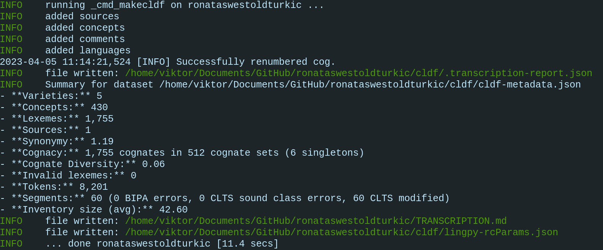

Part 1: Create CLDF
===================

The following six steps will guide you through the process of
converting raw language data to CLDF. Each step can be found in the
`continuous integration workflow
<https://app.circleci.com/pipelines/github/LoanpyDataHub/ronataswestoldturkic>`_
as well. The data we are converting comes from the etymological dictionary
`"West Old Turkic"
<https://www.goodreads.com/book/show/13577601-west-old-turkic>`_
(Róna-Tas and Berta 2011),
which contains modern Hungarian words as headwords, together with their
documented and reconstructed ancestor forms, including their
West Old Turkic donor words. West Old Turkic, also called `Proto-Bolgar
<https://glottolog.org/resource/languoid/id/bolg1249>`_, is the parent
language of the western branch
of Turkic languages. The raw data contains only a small fraction of the
contents of the dictionary. If you are passionate about pdf-wrangling,
Mongolic, Turkic, or Finno-Ugric languages and want to expand this data set,
definitely check out the `contribution guidelines
<https://github.com/martino-vic/ronataswestoldturkic/blob/main/CONTRIBUTING.md>`_
and let's get in touch!

Step 1: Clone the repository
----------------------------

It is strongly recommended to create and activate a virtual environment first.
This can be for example done by running

.. code-block:: sh

   python3 -m venv venv
   source venv/bin/activate

To deactivate it, run:

.. code-block:: sh

   deactivate

in an activated virtual environment. And to delete it, deactivate it and run:

.. code-block:: sh

   rm -r venv

Once You have set it up and activated it, you can start the process
of CLDF conversion by installing this repository:

.. code-block:: sh

   git clone https://github.com/martino-vic/ronataswestoldturkic.git

Originally, the skeleton of the repository was created using this command:

.. code-block:: sh

   cldfbench new

and answering the follow-up questions. More on this can be read in the
`cldfbench tutorial <https://github.com/cldf/cldfbench/blob/master/doc/tutorial.md>`_.

Step 2: Clone reference catalogues
----------------------------------

- `Glottolog <https://glottolog.org/>`_ (Hammarström et al. 2022)
  to reference the languages in the repo.
- `Concepticon <https://concepticon.clld.org/>`_ (List et al. 2023) to
  reference concepts.
- `CLTS <https://clts.clld.org/>`_ (List et al. 2021) to reference IPA
  characters

.. warning::

   The following repositories will take over 1GB in disk-space. If you skip
   cloning them,
   add a ``--dev`` flag to the command running the lexibank script in step 5.

.. code-block:: sh

   mkdir concepticon
   cd concepticon
   git clone https://github.com/concepticon/concepticon-data.git
   cd ..
   git clone https://github.com/glottolog/glottolog.git
   git clone https://github.com/cldf-clts/clts.git

Step 3: Install commands and loanpy
-----------------------------------

The ``-e`` flag will install all necessary dependencies in development mode.
I.e. if you modify any code in those repositories, changes will apply
immediately. Remember to run this command from the directory where
all your GitHub repositories are stored.

.. code-block:: sh

   pip install -e ronataswestoldturkic

Install `loanpy <https://loanpy.readthedocs.io/en/latest/home.html>`_
(Martinović 2023):

.. code-block:: sh

   pip install loanpy

Step 4: Create IPA transcriptions
-------------------------------------------

If the folder ``etc`` contains a folder ``orthography`` with files having the
same
name as the language IDs in ``etc/languages.tsv``, CLDF automatically creates
new columns in ``cldf/forms.csv`` that contain
IPA transcriptions and segmentations. In this step, we are creating the
IPA transcription rules for our raw data. The data in the original source
already comes phonetically transcribed. However, this is an idiosyncratic
transcription system, unique to the source and therefore not suitable for
data intended for cross-linguistic comparisons. The transcription
system is well described in the appendix of the work and this can be used to
to map each element to its counterparts in `IPA
<https://www.internationalphoneticassociation.org/sites/default/files/IPA_Kiel_2015.pdf>`__.
Hungarian
headwords in the original source were provided in both, their official
orthographic form and their transcription to the internal
phonetic alphabet. We included only the modern orthographic forms.
Therefore, an additional orthography had to be added for IPA-transcription.
The skeleton for this comes from a `file in the open source library epitran
<https://github.com/dmort27/epitran/blob/master/epitran/data/map/hun-Latn.csv>`_.
Some of the combinatorics for the hard-coded transcription rules were created
with an online tool called `Orthographic Profiler
<https://digling.org/calc/profiler/>`_. The transcription profiles were
written to the files ``H.tsv`` ``EAH.tsv`` ``LAH.tsv`` ``OH.tsv`` and
``WOT.tsv`` in the folder ``etc/orthography``.

Step 5: Run lexibank script
---------------------------

This script combines files from the raw and etc folders and creates and
populates the folder cldf

.. code-block:: sh

   cd ronataswestoldturkic
   cldfbench lexibank.makecldf lexibank_ronataswestoldturkic.py  --concepticon-version=v3.0.0 --glottolog-version=v4.5 --clts-version=v2.2.0 --concepticon=../concepticon/concepticon-data --glottolog=../glottolog --clts=../clts

Below is a detailed description of what the script does. See also the
tutorial at https://calc.hypotheses.org/3318, which has many similarities.
This is the first lexibank script that uses the
``args.writer.align_cognates()`` prompt for automatic cognate alignment
(see `discussion on GitHub
<https://github.com/lexibank/pylexibank/issues/267#issuecomment-1418959540>`_).
It is also one of the first CLDF repositories to link various historical
stages of the same language to each other, covering horizontal and vertical
transfers.

.. code-block:: python

   import ast
   import json
   import pathlib

   import attr
   from clldutils.misc import slug
   from loanpy.utils import IPA
   from pylexibank import Dataset as BaseDataset, FormSpec, Lexeme

First, we import three inbuilt Python-libraries.

- The `ast <https://docs.python.org/3/library/ast.html>`_ library will turn
  the strings "True" and "False" into booleans.
- The `json <https://docs.python.org/3/library/json.html>`_ library
  will be used to read the data-cleaning instructions for the
  ``pylexibank.FormSpec`` class.
- The `pathlib <https://docs.python.org/3/library/pathlib.html>`_ library
  will be used to define file paths

Then, we import functionalities from various third-party libraries.
These were installed when running
``pip install -e ronataswestoldturkic`` eariler.

- With the `attrs <https://www.attrs.org/en/stable/index.html>`_ library
  we will create the custom language class with custom columns in the output
  file ``cldf/forms.csv``.
- The `slug <https://clldutils.readthedocs.io/en/latest/misc.html#clldutils.misc.slug>`_
  function from the `clldutils <https://github.com/clld/clldutils>`_ library
  will be used to format some IDs.
- The `IPA
  <https://loanpy.readthedocs.io/en/latest/documentation.html#loanpy.utils.IPA>`__
  class from the `loanpy <https://loanpy.readthedocs.io/en/latest/home.html>`_
  library will be used to create the phonotactic structures of words.
- The classes from the `pylexibank <https://pypi.org/project/pylexibank/>`_
  library are all related to specifying the output format. ``Dataset`` for
  example loads the default data format, ``Lexeme`` will be used to customise
  it, and ``FormSpec`` will be used to document the cleaning of the raw data.

.. code-block:: python

   ipa = IPA()

Here, we are creating an instance of loanpy's IPA class which loads
a list of 1464 IPA sounds that are vowels into its ``.vowels`` attribute.

.. code-block:: python

   with open("etc/formspec.json") as f:
       REP = [(k, v) for k, v in json.load(f).items()]

The variable REP stands for 'replacements' and will later be used to create
the column "forms" from the column "values", where replacements are
hard-coded. Since the number of transformations is too large to include them
in this script, they were written to a json-file, which is loaded here.

.. code-block:: python

   @attr.s
   class CustomLexeme(Lexeme):
       CV_Segments = attr.ib(default=None)
       ProsodicStructure = attr.ib(default=None)
       FB_VowelHarmony = attr.ib(default=None)
       Year = attr.ib(default=None)

Here we define custom columns that are not included by default, using
`attr.ib <https://www.attrs.org/en/stable/api-attr.html#attr.ib>`_ and the
Lexeme class that we have imported earlier.

.. code-block:: python

    def has_harmony(segments):
    if any(i in segments for i in ['y', 'yː', 'ø', 'øː']):
        if any(i in segments for i in ['a', 'aː', 'ɒ', 'ɯ', 'u', 'uː', 'o']):
            return False
    return True

Here we define a function that checks whether a word has vowel harmony or not.

.. code-block:: python

   def get_loan(loan, language):
       return ast.literal_eval(loan) if language == "WOT" else True

Here we convert the textual information from the column ``WOT_loan`` in
``raw/wot.tsv`` to booleans with `literal_eval
<https://docs.python.org/3/library/ast.html#ast.literal_eval>`_.
This has to be a separate function and can't be implemented through a lambda.

.. code-block:: python

    class Dataset(BaseDataset):
        dir = pathlib.Path(__file__).parent
        id = "ronataswestoldturkic"
        lexeme_class = CustomLexeme
        form_spec = FormSpec(separators=",", first_form_only=True,
                             replacements= REP)

Here we define a class and inherit the default format ``BaseDataset`` that we
have imported in the beginning. ``dir`` is the working directory and is
defined with the help of ``pathlib`` that we have imported in the beginning.
``id`` is the name of the repository. In ``lexeme_class`` we are plugging in
the custom columns that we have created earlier. In ``form_spec`` we are
plugging in the data-cleaning rules that were hard coded in
``etc/formspec.json`` and read into the ``REP`` variable earlier, using the
``FormSpec`` class we have imported in the beginning.

.. code-block:: python

	def cmd_makecldf(self, args):

This function is being run when summoning the lexibank script from the
command line. It converts the data from the folders ``raw`` and ``etc`` to
standardised CLDF data.

.. code-block:: python

        args.writer.cldf.add_component(
            "BorrowingTable"
        )

Here we are creating a `BorrowingTable
<https://cldf.clld.org/v1.0/terms.rdf#BorrowingTable>`_
``cldf/borrowings.csv`` which will contain the IDs of donor and recipient
words.

.. code-block:: python

        args.writer.add_sources()
        args.log.info("added sources")

In the first line we are adding the bibliography from ``raw/sources.bib``.
This is a `BibTex <https://en.wikipedia.org/wiki/BibTeX>`_ file containing
references to all sources from which the data in the folders ``raw`` and
``etc`` was acquired. In the second line we log to the console
that the sources were added successfully. This can be helpful for debugging.

.. code-block:: python

        concepts = {}
        for i, concept in enumerate(self.concepts):
            idx = str(i)+"_"+slug(concept["ENGLISH"])
            concepts[concept["ENGLISH"]] = idx
            args.writer.add_concept(
                    ID=idx,
                    Name=concept["ENGLISH"],
                    Concepticon_ID=concept["CONCEPTICON_ID"],
                    Concepticon_Gloss=concept["CONCEPTICON_GLOSS"],
                    )

        args.log.info("added concepts")

This section of the script creates the file ``cldf/parameters.csv``, which
links the translations of words to concepts in
`Concepticon <https://concepticon.clld.org/>`_. It is based on
``etc/concepts.tsv``, which was created through multiple steps. At first, the
translations were mapped automatically with the
`pysem <https://pypi.org/project/pysem/>`_ library. Then, these mappings were
manually refined and requested to be submitted to Concepticon through a
`Pull Request on GitHub
<https://github.com/concepticon/concepticon-data/pull/1240>`_. After some
discussion and further refinement, the conceptlist was submitted and is
available
`here <https://concepticon.clld.org/contributions/RonaTas-2011-431>`__.
The file ``etc/concepts.tsv`` was then accordingly copied again from
`GitHub
<https://github.com/concepticon/concepticon-data/blob/master/concepticondata/conceptlists/RonaTas-2011-431.tsv>`_

.. code-block:: python

        comments = self.etc_dir.read_csv(
            "comments.tsv", delimiter="\t",
        )
        comments = {line[0]: line[1] for line in comments}
        args.log.info("added comments")

Here we are reading the file ``etc/comments.tsv``, which was originally
created with a custom script from an additional column in ``raw/wot.tsv``.

.. code-block:: python

        languages = args.writer.add_languages()
        args.log.info("added languages")

Here, we read the file ``etc/languages.tsv`` which contains the references to
`Glottolog <https://glottolog.org/>`_ and write the information to
``cldf/languages.csv``. Out of the five languages in this repository, only
Hungarian is clearly present in Glottolog. Old Hungarian is missing, but a
`request <https://github.com/glottolog/glottolog/issues/899>`_ was opened to
add it and after some discussion there seems to be a plan to include it in a
future version of Glottolog. Early and Late Ancient Hungarian are categories
that are only used in our source and can therefore not be added to Glottolog,
according to its `principles
<https://glottolog.org/glottolog/glottologinformation#principles>`_. Even
though Glottolog does not contain Proto-languages, the nodes in their
language
family trees have their own glotto-codes, which serve as a reasonable proxy.
In the case of West Old Turkic, the ancestor language of Bolgarian and Chuvash,
we can thus insert the glotto-code of `Bolgar
<https://glottolog.org/resource/languoid/id/bolg1249>`_ into our table.

.. code-block:: python

        data = self.raw_dir.read_csv(
            "wot.tsv", delimiter="\t",
        )
        header = data[0]
        cognates = {}
        cogidx = 1
        borrid = 1

Here we read the file ``raw/wot.tsv`` and define some variables that we are
going to use in a bit.

.. code-block:: python

        for i in range(1, len(data)):
            cognates = dict(zip(header, data[i]))
            concept = data[i][7]
            eah = ""

Here we will loop through the raw data ``raw/wot.tsv`` row by row from top to
bottom and define some variables that we will need later. The column "ENGLISH"
is hard-coded as column seven. If it was to be moved to a different index for
which ever reason, the index in this part of the code would need to be updated
accordingly.

.. code-block:: python

            for language in languages:

Here we loop from left to right through the columns of each row, which contain
data relating to words in different languages. The languages themselves were
defined earlier in ``etc/languages.tsv``.

.. code-block:: python

                cog = cognates.get(language, "").strip()

Here we are reading the specific word in the specific language from the raw
data.

.. code-block:: python

                if concept not in cognates:
                    cognates[concept] = cogidx
                    cogidx += 1
                cogid = cognates[concept]

The goal of this section is simply to assign a unique cognate ID to each
English translation in column seven. Identical translations will get identical
IDs. This value will appear in the column ``Cognacy`` in the output file
``cldf/forms.csv`` later.

.. code-block:: python

                for lex in args.writer.add_forms_from_value(
                        Language_ID=language,
                        Parameter_ID=concepts[concept],
                        Value=cog,
                        Comment=comments.get(concept, ""),
                        Source="wot",
                        Loan=get_loan(cognates["WOT_loan"], language),
                        Cognacy=cogid,
                        Year=cognates["Year"]
                        ):

This is arguably the most important part of the script. It creates the file
``cldf/forms.csv`` which will serve as the main input file for further
analyses. ``args.writer.add_forms_from_value`` creates the file, through which
we then loop. The arguments in the brackets are the column names.
``Language_ID`` is the name of the language according to
``etc/languages.tsv``. ``Parameter_ID`` references the relevant row in
``parameters.csv``, which was created in an earlier code-block. ``Value`` is
the original raw data. The column ``Form`` is automatically being created from
column ``Value`` by applying the cleaning procedure specified in
``etc/formspec.json`` which was read into the
``REP`` variable in the beginning. The column
``Comment`` uses the English translations as dictionary keys to look up the
according comment as specified in ``etc/comments.tsv``. The entire data set is
based on one source. In the column ``Source`` we are specifying the BibTex key
of it, as described in ``raw/sources.bib``. The column ``Loan`` specifies
whether a word is a loanword or not. This information is stored in column
``WOT_loan`` in ``raw/wot.tsv`` and is converted to a boolean through the
function ``get_loan`` which was described in an earlier code-block.
``Cognacy`` assigns a unique identifier to each cognate set in the form of an
integer that starts at 1 and is incremented by 1 with each new cognate set.
The column ``Year`` is another custom column that was specified in the
``CustomLexeme`` class earlier. This information is provided in column
``Year`` in ``raw/wot.tsv`` and represents each word's year of first
appearance in a written source.

.. code-block:: python

   lex["CV_Segments"] = ipa.get_clusters(lex["Segments"])
   lex["ProsodicStructure"] = ipa.get_prosody(
                                          " ".join(lex["Segments"])
                                          )
   lex["FB_VowelHarmony"] = has_harmony(lex["Segments"])

Here we populate three more columns which take information from the columns of
the newly generated ``cldf/forms.csv`` as input. That's why they have to be
populated through a loop rather than in the brackets of the earlier function.
The column ``CV_Segments`` takes the column ``Segments`` of ``cldf/forms.csv``
as input, which in turn is automatically generated from the information stored
in ``etc/orthography``. These columns are based on tokenised IPA-strings,
that were read from the files in ``etc/orthography``. The column
``ProsodicStructure`` is created with `loanpy.utils.IPA.get_prosody
<https://loanpy.readthedocs.io/en/latest/documentation.html#loanpy.utils.IPA.get_prosody>`_.
The column ``FB_VowelHarmony`` checks if a word has front-back vowel harmony
based on a function defined earlier in this script.

.. code-block:: python

                    if language == "EAH":
                        eah = lex["ID"]

This line is storing the ID of the relevant word in ``cldf/forms.csv``, so it
can later be referenced in ``cldf/borrowings.csv``.

.. code-block:: python

                    args.writer.add_cognate(
                            lexeme=lex,
                            Cognateset_ID=cogid,
                            Source="wot"
                            )

Here we create the table ``cldf/cognates.csv``. This is the table where
automated alignments will be carried out, which can be used for further
analyses. The term ``cognate`` here is used in its broader sense and includes
all words that go back to the same etymon.

.. code-block:: python

                    if language == "WOT" and eah:
                        args.writer.objects["BorrowingTable"].append({
                            "ID": f'{borrid}-{lex["Parameter_ID"]}',
                            "Target_Form_ID": eah,
                            "Source_Form_ID": lex["ID"],
                            "Source": lex["Source"]
                            })
                        borrid += 1
                        eah = None

                args.log.info("FormTable, CognateTable, BorrowingTable: done")

Here the file ``cldf/borrowings.csv`` is created. It contains reference keys
to ``cldf/forms.csv`` to identify each donor and recipient word. It makes sure
that only those concepts are included where a form in both West Old Turkic
(the donor language) and Early Ancient Hungarian (the recipient language)
exist. In the end, we print the information to the logger, that the three
tables were created successfully from the current loop.

.. code-block:: python

        args.writer.align_cognates()
        args.log.info("Cognate alignment: done")

This is the final line, which creates automated alignments with the
`lingpy <https://lingpy.org/>`_ library. They are added to a newly created
column called ``ALIGNMENTS`` in ``etc/cognates.csv``. This repository is the
first use-case for this functionality (see `discussion on GitHub
<https://github.com/lexibank/pylexibank/issues/267#issuecomment-1418959540>`_
).

This is how your console should approximately look after the conversion:

         text displayed in it in white and green. The text reads:
          (venv) viktor@viktor-Latitude-5430:~/Documents/GitHub/ronataswestoldturkic$ bash wot.sh
          INFO    running _cmd_makecldf on ronataswestoldturkic ...
          INFO    added sources
          INFO    added concepts
          INFO    added comments
          INFO    added languages
          2023-04-27 23:55:27,155 [INFO] Successfully renumbered cog.
          INFO    file written: /home/viktor/Documents/GitHub/ronataswestoldturkic/cldf/.transcription-report.json
          INFO    Summary for dataset /home/viktor/Documents/GitHub/ronataswestoldturkic/cldf/cldf-metadata.json
          - **Varieties:** 5
          - **Concepts:** 430
          - **Lexemes:** 1,755
          - **Sources:** 1
          - **Synonymy:** 1.19
          - **Cognacy:** 1,755 cognates in 512 cognate sets (6 singletons)
          - **Cognate Diversity:** 0.06
          - **Invalid lexemes:** 0
          - **Tokens:** 8,190
          - **Segments:** 60 (0 BIPA errors, 0 CLTS sound class errors, 60 CLTS modified)
          - **Inventory size (avg):** 42.80
          INFO    file written: /home/viktor/Documents/GitHub/ronataswestoldturkic/TRANSCRIPTION.md
          INFO    file written: /home/viktor/Documents/GitHub/ronataswestoldturkic/cldf/lingpy-rcParams.json
          INFO    ... done ronataswestoldturkic [9.2 secs]

Step 6: Test with pytest-cldf whether the dataset is CLDF-conform
-----------------------------------------------------------------

Now that the conversion has run successfully, the only thing left to do is to
verify that the data conforms to the CLDF standard:

.. code-block:: sh

   pip install pytest-cldf
   pytest --cldf-metadata=cldf/cldf-metadata.json test.py

This will run one single test with the
`pytest <https://docs.pytest.org/en/7.2.x/>`_ library, which should pass.
And with this we have converted our raw data to CLDF and thus finished part
one. Click on the ``Next``-button to get to part two.
