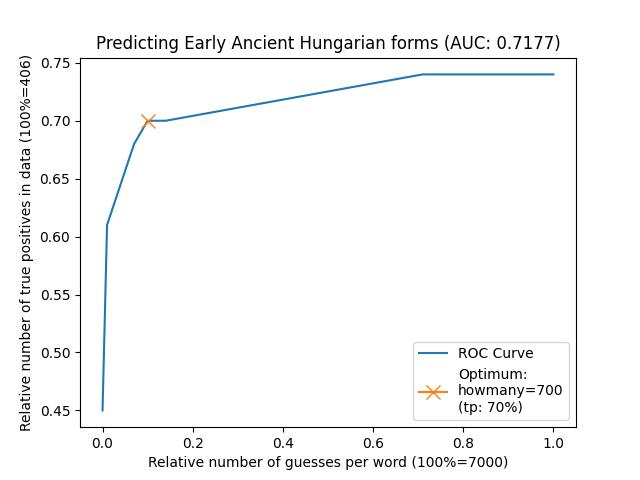
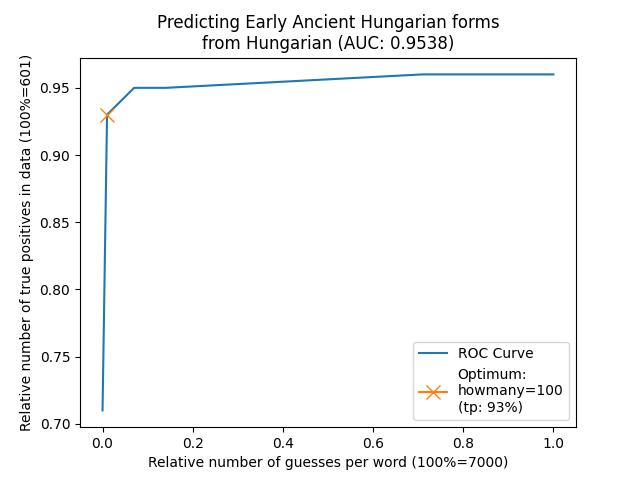
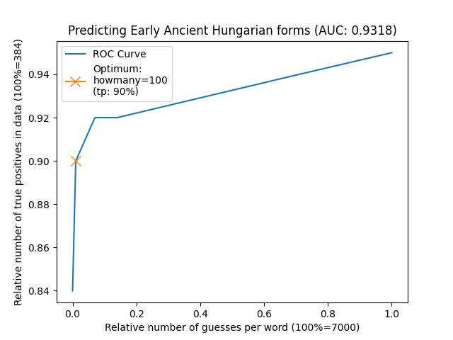

Part 3: Analyse data with LoanPy
================================

The following six steps describe how to input aligned CLDF data to `loanpy
<https://loanpy.readthedocs.io/en/latest/home.html>`_, and how to mine sound
correspondences and evaluate and visualise their predictive power.

Step 1: Mine phonotactic inventory
----------------------------------

These are necessary to predict phonotactic repairs during loanword adaptation.

.. code-block:: sh

   cldfbench ronataswestoldturkic.mineEAHinvs invs.json

.. automodule:: ronataswestoldturkiccommands.mineEAHinvs
   :members:

Step 2: Create heuristic sound substitutions
--------------------------------------------

Since any existing phoneme can be adapted when entering a language through
a loanword, we have to create a heuristic adaptation prediction for as many
IPA characters as possible, in this case 6491.

.. code-block:: sh

   cldfbench ronataswestoldturkic.makeheur EAH heur.json

.. automodule:: ronataswestoldturkiccommands.makeheur
   :members:

Step 3: Mine vertical and horizontal sound correspondences
----------------------------------------------------------

The output will serve as fuel for predicting loanword adaptations and
historical reconstructions later on.

.. code-block:: sh

   cldfbench ronataswestoldturkic.minesc H EAH

.. code-block:: sh

   cldfbench ronataswestoldturkic.minesc WOT EAH heur.json

.. automodule:: ronataswestoldturkiccommands.minesc
   :members:

Step 4: Make sound correspondences human-readable
-------------------------------------------------

The sound-correspondence file is stored as a computer-readable json.
To create a human-readable tsv-file, run:

.. code-block:: sh

   cldfbench ronataswestoldturkic.vizsc H EAH
   cldfbench ronataswestoldturkic.vizsc WOT EAH

.. automodule:: ronataswestoldturkiccommands.vizsc
   :members:

Step 5: Evaluate vertical and horizontal sound correspondences
--------------------------------------------------------------

In this section, we are checking the predictive power of the mined
sound correspondences with loanpy's `eval_all
<https://loanpy.readthedocs.io/en/latest/documentation.html#loanpy.eval_sca.eval_all>`_
function

.. code-block:: sh

   cldfbench ronataswestoldturkic.evalsc H EAH "[10, 100, 500, 700, 1000, 5000, 7000]"

.. code-block:: sh

   cldfbench ronataswestoldturkic.evalsc WOT EAH "[10, 100, 500, 700, 1000, 5000, 7000]" True True heur.json

.. automodule:: ronataswestoldturkiccommands.evalsc
   :members:

Step 6: Plot the evaluations
----------------------------

To gauge the performance of the model, we can plot an `ROC
<https://en.wikipedia.org/wiki/Receiver_operating_characteristic>`_ curve,
calculate its optimum cut-off value and its area under the curve `(AUC)
<https://en.wikipedia.org/wiki/Receiver_operating_characteristic#Area_under_the_curve>`_,
a common metric to evaluate predictive models:

.. code-block:: sh

   cldfbench ronataswestoldturkic.plot_eval H EAH
   cldfbench ronataswestoldturkic.plot_eval WOT EAH

The results:

Predicting reconstructions from modern Hungarian words:

         in an arch from the lower left hand corner towards the upper left
         hand corner and then the upper right hand corner. Title of the
         plot reads "Predicting Early Ancient Hungarian forms (AUC:
         0.7177)". The y-axis reads "Relative number of true positives
         in data (100%=406)". Its values go from 0.45 until 0.75 in steps of
         0.5. The x-axis reads "Relative number of guesses per word
         (100%=7000)". Its values go from 0.0 to 1.0 in steps of 0.2.
         In the bottom right hand corner there's an info box with a blue line
         saying "ROC Curve" and a dark yellow or ochre line with a dark yellow
         X on it that reads "Optimum: howmany=700 (tp: 70%)". There's a dark
         yellow/ochre X on the graph at 0.1 on the x-axis and 0.7 on
         the y-axis.

   The ROC curve shows how the relative number of true positives (y-axis)
   increases, as the relative number of false positives (x-axis) increases.
   The optimal cut-off point is at 700 false positives per word, which yields
   284 correct reconstructions out of 406 (i.e. 70%). The AUC is just above
   0.7, which `is considered acceptable
   <https://www.sciencedirect.com/science/article/pii/S1556086415306043>`_.
   Note that the relative number of false positives and the AUC stay the same,
   irrespective of whether false positives are counted on a
   per-word basis (7000) or as an aggregate sum (7000 * 813= 5,691,000).
   The absolute number of possible true positives (406) was reached after
   prefiltering the 512 cognate sets of the raw data in `Part 2 step 1
   <https://ronataswestoldturkic.readthedocs.io/en/latest/mkedictor.html#ronataswestoldturkiccommands.maketoedict_rc.run>`_.

The performance of this model can be improved by removing irregular sound
correspondences. By inspecting the file `loanpy/H2EAHsc.tsv` we can see that
many words contain sound correspondences that occur only once throughout
the entire etymological dictionary. Counting the number of those cognate sets
shows that 106 out of 406 or 26% of all etymologies contain at least one sound
correspondence that is irregular, i.e. occurs only in one single etymology.
(Note that the pre-filtering did not skew this ratio because it picked all
cognate sets with an Early Ancient Hungarian and a Hungarian counterpart.)
If we remove those 106 cognate sets with irregular sound correspondences
from our training and test data, 300 cognate sets remain and we get following
result:

         in a steep arch from the lower left hand corner towards the upper
         left hand corner and then the upper right hand corner. Title of the
         plot reads "Predicting Early Ancient Hungarian forms (AUC:
         0.9538)". The y-axis reads "Relative number of true positives
         in data (100%=300)". Its values go from 0.70 until 0.95 in steps of
         0.5. The x-axis reads "Relative number of guesses per word
         (100%=7000)". Its values go from 0.0 to 1.0 in steps of 0.2.
         In the bottom right hand corner there's an info box with a blue line
         saying "ROC Curve" and a dark yellow or ochre line with a dark yellow
         X on it that reads "Optimum: howmany=100 (tp: 93%)". There's a dark
         yellow/ochre X on the graph at almost 0.0 on the x-axis and 0.93 on
         the y-axis.

   This model performs significantly better than the previous one. At its
   optimum of 100 guesses per word it reconstructs 279 out of 300 forms (93%)
   correctly. The
   AUC is above 0.9, which `is considered outstanding
   <https://www.sciencedirect.com/science/article/pii/S1556086415306043>`_.

   Test caption
   
Predicting loanword adaptations from West Old Turkic words:

         in a diagonal line from the lower left hand corner towards the upper
         left hand corner and then straight towards the upper right hand
         corner. The Title of the
         plot reads "Predicting Early Ancient Hungarian forms (AUC:
         0.9318)". The y-axis reads "Relative number of true positives
         in data (100%=384)". Its values go from 0.84 until 0.94 in steps of
         0.2. The x-axis reads "Relative number of guesses per word
         (100%=7000)". Its values go from 0.0 to 1.0 in steps of 0.2.
         This time, the info box is in the upper left-hand corner with a blue
         line saying "ROC Curve" and a dark yellow or ochre line with a
         dark yellow
         X on it that reads "Optimum: howmany=100 (tp: 93%)". There's a dark
         yellow/ochre X on the graph at almost 0.0 on the x-axis and 0.9 on
         the y-axis.

    Out of 512 etymologies, 384 contained loanword adaptations from West
    Old Turkic into Early ancient Hungarian. This pre-filtering was carried
    out in `Part 2 step 1
    <https://ronataswestoldturkic.readthedocs.io/en/latest/mkedictor.html#ronataswestoldturkiccommands.maketoedict_rc.run>`__.
    At its optimum of 100 guesses per word, the model predicted 346 words
    correctly out of 384 (90%). The
    AUC is above 0.9, which `is considered outstanding
    <https://www.sciencedirect.com/science/article/pii/S1556086415306043>`__.

What happened under the hood:

.. automodule:: ronataswestoldturkiccommands.plot_eval
   :members:
