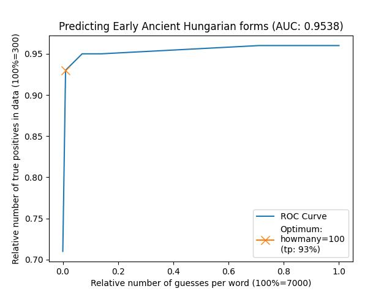

Part 3: Analyse data with loanpy
================================

The following six steps describe how to input aligned CLDF data to `loanpy
<https://loanpy.readthedocs.io/en/latest/home.html>`_, and how to mine sound
correspondences and evaluate and visualise their predictive power.

Step 1: Mine phonotactic inventory
----------------------------------

These are necessary to predict phonotactic repairs during loanword adaptation.

.. code-block:: sh

   cldfbench ronataswestoldturkic.mineEAHinvs invs.json

.. automodule:: ronataswestoldturkiccommands.mineEAHinvs
   :members:

Step 2: Create heuristic sound substitutions
--------------------------------------------

Since any existing phoneme can be adapted when entering a language through
a loanword, we have to create a heuristic adaptation prediction for as many
IPA characters as possible, in this case 6491.

.. code-block:: sh

   cldfbench ronataswestoldturkic.makeheur EAH heur.json

.. automodule:: ronataswestoldturkiccommands.makeheur
   :members:

Step 3: Mine vertical and horizontal sound correspondences
----------------------------------------------------------

The output will serve as fuel for predicting loanword adaptations and
historical reconstructions later on.

.. code-block:: sh

   cldfbench ronataswestoldturkic.minesc H EAH

.. code-block:: sh

   cldfbench ronataswestoldturkic.minesc WOT EAH heur.json

.. automodule:: ronataswestoldturkiccommands.minesc
   :members:

Step 4: Make sound correspondences human-readable
-------------------------------------------------

The sound-correspondence file is stored as a computer-readable json.
To create a human-readable tsv-file, run:

.. code-block:: sh

   cldfbench ronataswestoldturkic.vizsc H EAH
   cldfbench ronataswestoldturkic.vizsc WOT EAH

.. automodule:: ronataswestoldturkiccommands.vizsc
   :members:

Step 5: Evaluate vertical and horizontal sound correspondences
--------------------------------------------------------------

In this section, we are checking the predictive power of the mined
sound correspondences with loanpy's `eval_all
<https://loanpy.readthedocs.io/en/latest/documentation.html#loanpy.eval_sca.eval_all>`_
function

.. code-block:: sh

   cldfbench ronataswestoldturkic.evalsc H EAH "[10, 100, 500, 700, 1000, 5000, 7000]"

.. code-block:: sh

   cldfbench ronataswestoldturkic.evalsc WOT EAH "[10, 100, 500, 700, 1000, 5000, 7000]" True True heur.json

.. automodule:: ronataswestoldturkiccommands.evalsc
   :members:

Step 6: Plot the evaluations
----------------------------

To gauge the performance of the model, we can plot an `ROC
<https://en.wikipedia.org/wiki/Receiver_operating_characteristic>`_ curve,
calculate its optimum cut-off value and its area under the curve `(AUC)
<https://en.wikipedia.org/wiki/Receiver_operating_characteristic#Area_under_the_curve>`_,
a common metric to evaluate predictive models:

.. code-block:: sh

   cldfbench ronataswestoldturkic.plot_eval H EAH
   cldfbench ronataswestoldturkic.plot_eval WOT EAH

The results:

Predicting reconstructions from modern Hungarian words:

.. figure:: ../loanpy/H2EAH.jpeg

   The ROC curve shows how the relative number of true positives (y-axis)
   increases, as the relative number of false positives (x-axis) increases.
   The optimal cut-off point is at 700 false positives per word, which yields
   569 correct reconstructions out of 813 (i.e. 70%). The AUC is just above
   0.7, which `is considered acceptable
   <https://www.sciencedirect.com/science/article/pii/S1556086415306043>`_.
   Note that the relative number of false positives and the AUC stay the same
   no matter whether we count false positives per word (7000) or in total
   (7000 * 813= 5,691,000).

The performance of this model can be improved by removing irregular sound
correspondences. By inspecting the file `loanpy/H2EAHsc.tsv` we can see that
many words contain sound correspondences that occur only once throughout
the entire dictionary. Counting the number of those cognate sets shows that
106 out of 512 or 20% of all etymologies contain at least one sound
correspondence that is irregular, i.e. occurs only in one single etymology.
If we remove those cognate sets from our training and test data we get
following result:

   This model performs significantly better than the previous one, with an
   AUC over 0.9, which `is considered outstanding
   <https://www.sciencedirect.com/science/article/pii/S1556086415306043>`_.

Predicting loanword adaptations from West Old Turkic words:

   The ROC curve shows how the relative number of true positives (y-axis)
   increases, as the relative number of false positives (x-axis) increases.
   The optimal cut-off point is at 7000 false positives per word, which yields
   569 correct reconstructions out of 813 (i.e. 70%). The AUC is above
   0.9, which `is considered outstanding
   <https://www.sciencedirect.com/science/article/pii/S1556086415306043>`_.

What happened under the hood:

.. automodule:: ronataswestoldturkiccommands.plot_eval
   :members:
